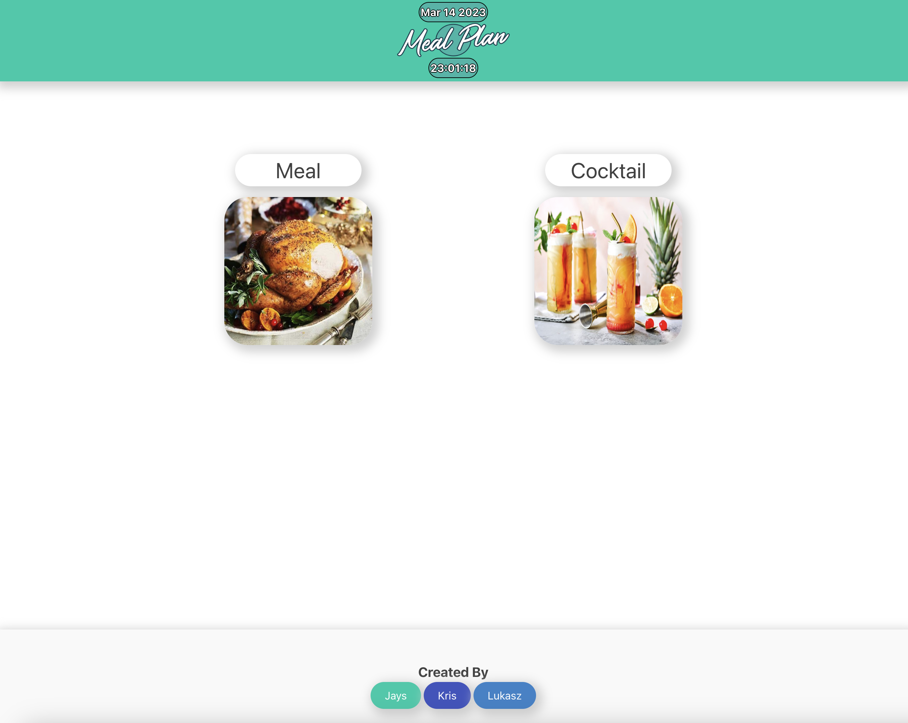
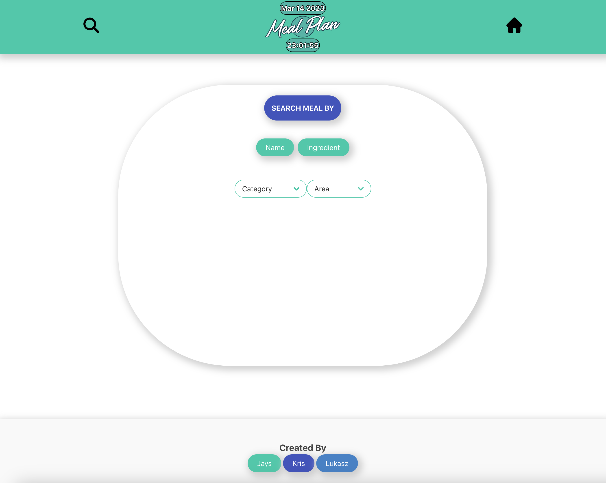
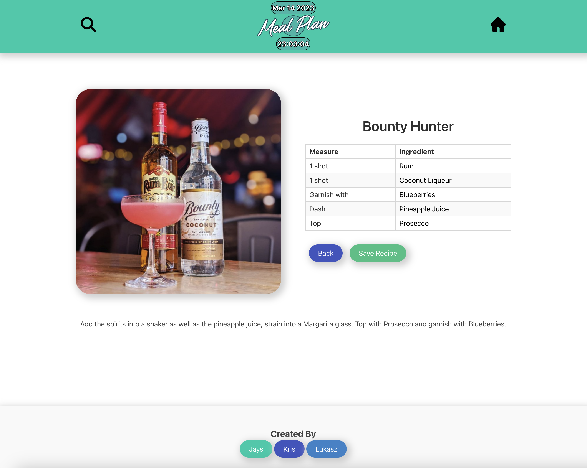

  
# Meal and Cocktail
This is a webpage where you can search for meals and cocktails recipes by name, ingredient, category, and area. You will be presented with a recipe and ingredients table, and you can save it to local storage so you will have access to your saved recipes.
# Getting Started
To get started, simply visit the webpage and enter the name, ingredient, category, or area of the recipe you are looking for in the search bar. The results will be displayed on the page, and you can click on any recipe to view its details.

# Features
* Search - You can search for recipes by name, ingredient, category, or area. The search bar is located at the top of the page, and it will filter the results as you type.
* Recipe Details - When you click on a recipe, you will be presented with its details, including the recipe name, ingredients, and instructions.
* Save to Local Storage - You can save recipes to your local storage by clicking on the "Save Recipe" button on the recipe details page. The recipe will be saved and can be accessed again at any time.
* Browse - You can browse recipes by category, such as appetizers, entrees, desserts, and cocktails. You can also browse by area, such as Italian, Mexican, and Chinese.

# Technologies Used
This webpage was built using HTML, CSS, JavaScript, and the Bulma framework. The recipes were sourced from https://www.themealdb.com and https://www.thecocktaildb.com/ .

# Contributors
This webpage was created by Kristiyan Tefov, Lukasz Jurkiewicz and Jayssen De Castro. 

## Links
Link to the webpage https://abstynent.github.io/project1-meal-plan-app/

Link to the repo https://github.com/Abstynent/project1-meal-plan-app

## Mock-Up

